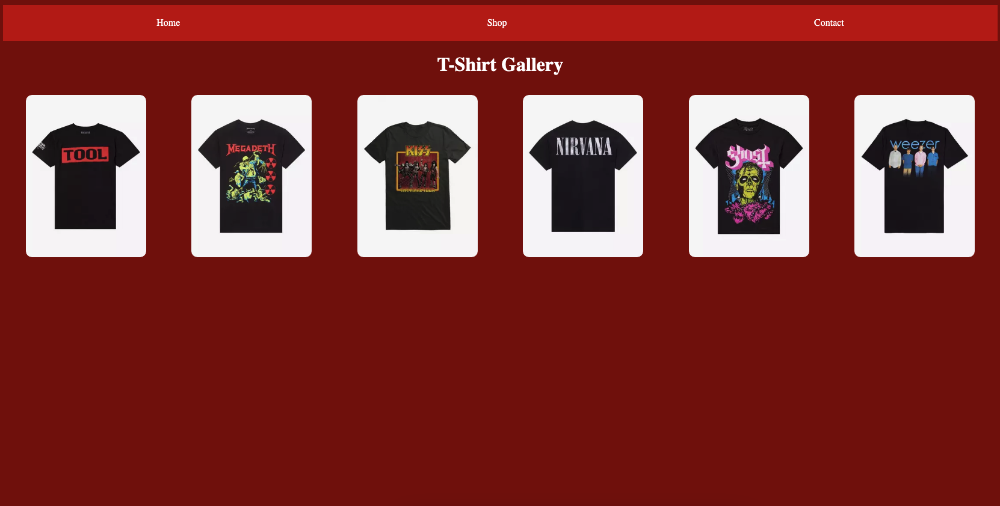

# css-transition

## Learning Target
- I am learning how to use the CSS ```position``` property to control how elements are positioned

## Success Criteria
- I can set ```position``` to ```absolute```, ```relative```, ```fixed```, and ```sticky```
- I can identify the differences between ```static```, ```absolute```, ```relative```, ```fixed```, and ```sticky```
- I can use ```top```, ```left```, ```bottom```, and ```right``` with ```position``` properties to position an element


## Get started
1. Install Live Server and Go Live to view how the webpage looks with no styling
2. Follow directions below

## Basic Page Styles
Use box model and flex properties to style the page so it looks like the screenshots below.
1. Follow along with my example for the nav
2. You complete the gallery

### Box Model Properties
```css
width
height
padding
border
margin
```

### Flex Container Properties
```css
container {
    display: flex;
    flex-direction: row | column;
    justify-content: start | end | center | space-around | space-between | space-evenly;
    align-items: start | end | center | stretch;
    flex-wrap: wrap | nowrap;
}
```

### Wide screen


### Narrow screen


## Transitions
1. Follow my example to add a transition for the a tags in the header to change background color and move up.  

2. Follow my example to add transistions for the gallery images to zoom-in and rotate.  
